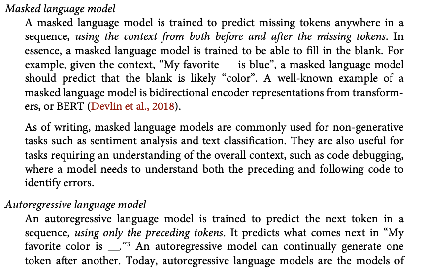
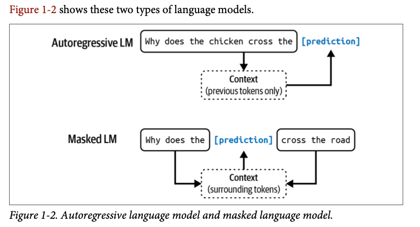
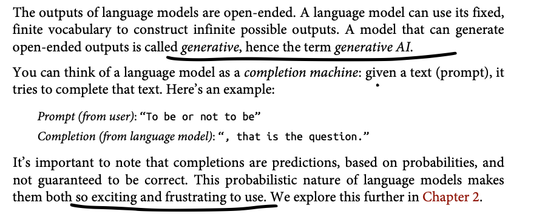
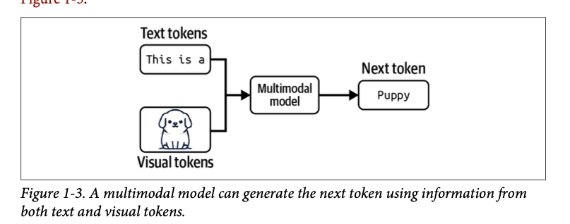
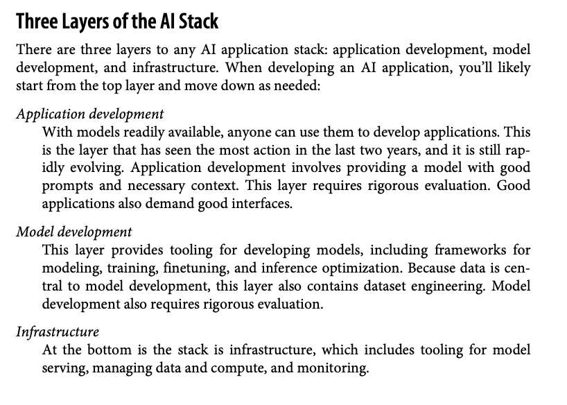
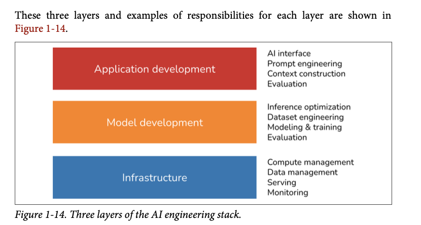

# Build-a-Large-Language-Model-From-Scratch---book-notes-and-experiments
The models you’ll create are smaller in scale compared to the large foundational models; they use the same concepts and serve as powerful educational tools to grasp the core mechanisms and techniques used in building state-of-the-art LLMs.

#### Majority of the content in this repo is from the book "Build a Large Language Model from Scratch" by Sebastian Raschka. All credits to the author for the amazing work. Some text is directly copied from the book and some is tuned for understanding concept better.

#### executing below steps in the book


# Chapter 1: understanding the large language models
<details>
<summary>🎯Q. LLMs vs Earlier NLP</summary>

- **LLMs (Large Language Models)** are transformer-based deep learning models trained on massive text datasets. They excel at generating context-aware, coherent text but lack human-level consciousness.
- **Earlier NLP Models** relied on:
  - Handcrafted rules or simpler algorithms for narrow tasks (e.g., spam detection, translation).
  - Focused on pattern recognition and categorization but struggled with nuanced, complex tasks.
- **Key Difference**: LLMs, powered by `transformers` and `large datasets`, represent a paradigm shift. They are versatile and capable of handling complex language understanding and generation tasks.

⭐ **Takeaway**: Transformers and massive datasets have revolutionized NLP, making it more flexible and powerful.
</details>


<details>
<summary>🎯Q. What is an LLM </summary>

- An LLM is a ⭐neural network⭐ designed to understand, generate, and respond to human-like text.
- when LLM can generate the text which appear coherant and contextually relevant they does not possess human-like `consciousness` or `comprehension`.
- Models like this often have tens or even hundreds of billions of parameters, which are the adjustable weights in the network that are optimized during training to predict the next word in a sequence.
- The “large” in “large language model” refers to both the model’s size in terms of parameters and the immense dataset on which it’s trained.
- Think of `parameters` as the number of knobs you can turn to adjust the model's behavior, and `training data` is like the vast library of books and articles the model reads to learn language patterns. 

- LLMs utilize an architecture called the `transformer`, which allows them to pay selective attention to different parts of the input when making predictions, making them
especially adept at handling the nuances and complexities of human language.

- ⭐⭐Machine learning⭐ and ⭐deep learning⭐ are fields aimed at implementing algorithms that enable computers
to learn from data and perform tasks that typically require human intelligence.⭐

- traditional machine learning requires a manual feature engineering step, where domain experts identify and extract relevant features from the data to train models. In contrast, deep learning models automatically learn hierarchical feature representations from raw data through multiple deep layers, eliminating the need for manual feature engineering.


</details>

<details>

- ⭐Research has shown that when it comes to modeling performance, custom-built LLMs—those tailored for specific tasks or domains—can outperform general-purpose LLMs⭐

<summary>🎯Q. Stages of building and using LLMs</summary>

- The process of creating an LLM involves two main stages: `pretraining` and `fine-tuning`.
- `Pretraining` involves training the model on large amounts of unlabeled text data to learn general language patterns (this is then usually referred to as a foundational model). Fine-tuning involves adapting the pretrained model to specific tasks using smaller, labeled datasets.
- 


</details>

<details>
<summary>🎯Q.Traditional Machine Learning vs. Pretraining and Fine-Tuning in LLMs ? </summary>

### 🎯 Traditional Machine Learning vs. Pretraining and Fine-Tuning in LLMs:
1. **Traditional Machine Learning**:
   - Uses `supervised learning`, where models are trained from scratch for a specific task using labeled data.
2. **LLM Pretraining**:
   - Relies on `self-supervised learning`, where the model learns general language patterns from massive amounts of unlabeled text data.
3. **LLM Fine-Tuning**:
   - Applies `supervised learning` on smaller, labeled datasets to adapt the model for specific tasks.

### Types of Fine-Tuning:
- **Instruction Fine-Tuning**:
  - Uses datasets with input-output pairs (e.g., questions and answers) to teach the model specific tasks.
- **Classification Fine-Tuning**:
  - Uses labeled datasets with text and class labels (e.g., emails labeled as “spam” or “not spam”).
  - This approach is common for tasks like sentiment analysis or topic classification.

</details>


<details>
<summary>🎯Q. Overview of the transformer architecture - key notes</summary>

- Most modern LLMs rely on the transformer architecture, which is a 💡`deep neural network architecture`💡 introduced in the 2017 paper “Attention Is All You Need”
- To understand LLMs, we must understand the original transformer, which was developed for machine translation, translating English texts to German and French.
- There are key two steps in the transformer architecture:
  1. The `encoder` processes the input text and creates a numerical representation of it (Embeddings) ⭐which capture the contextual information of the input.⭐
  2. The `decoder` takes this representation initially convert literally word by word  and then goes through `self-attention` and then generates the final output text.
- Both the encoder and decoder consist of many layers connected by a so-called self-attention mechanism
- This image is simple initial depiction however many things goes inside which autor is about to explain in the next chapters.


- After this paper on this concept other variants transformer emerged and become backbone of many LLMs. Like BERT (short for bidirectional
encoder representations from transformers) and the various GPT models (short for generative pretrained transformers)
- 
</details>

<details>
<summary>🎯Q. A closer look at the GPT architecture</summary>

- GPT was originally introduced in the paper “Improving Language Understanding by Generative Pre-Training” in 2018 by Alec Radford and colleagues at OpenAI.
- The model is simply trained to preduct the next --> word in a sequence of words.
- Compared to the original transformer architecture we covered in section 1.4, the general GPT architecture is relatively simple. Essentially, it’s just the decoder part without the encoder.
- Since decoder-style models like GPT generate text by predicting text one word at a time, they are considered a type of `autoregressive model`.
- To be `autoregressive` means that a model uses it's own past outputs or data points as inputs to predict future values in a sequence.
- The ability to perform tasks that the model wasn’t explicitly trained to perform is called an `emergent behavior`. This capability isn’t explicitly taught during training but emerges as a natural consequence of the model’s exposure to vast quantities of multilingual data in diverse contexts.

- GPT models are trained on relatively simple tasks which is predicting the next word in a sequence.
- The next-word prediction task in GPT models is a type of self-supervised learning where the model uses the next word in a sentence as the label to predict. This approach eliminates the need for manually labeled data and allows training on massive unlabeled text datasets.
- GPT models are trained on simple objectives like predicting the next word in a sequence. Despite this, their large size and diverse training data enable them to perform tasks like translation, summarization, and question answering without task-specific training. Additionally, they exhibit emergent behaviors, allowing them to handle tasks they weren't explicitly trained for.

</details>


<details>
<summary>🎯Q. Building a large language model - stages (section 1.7)</summary>

- from the book - "Build a Large Language Model from Scratch" by Sebastian Raschka
- 
</details>


# Chapter 2: working with text data

<details>
<summary>🎯Q. what is embeddings means?</summary>

 - The concept of `converting data into a vector format` is often referred to as `embedding`.
 - It’s important to note that `different data formats require distinct embedding models`. For example, an embedding model designed for text would not be suitable for embedding audio or video data.
 - ⭐The primary purpose of embeddings is to convert non-numeric data into a format that neural networks can process.⭐ very intresting very intresting

</details>

<details>
<summary>🎯Q. Key steps in data preparation which includes embeddings - IMPORTANT</summary>

- All the steps along with test code is mentiond under @chp_02_embeddings/embeddings.ipynb file. Please have a look.
- Below is the summary of the steps.
  1. `Tokenization` - breaking down text into smaller units called tokens.
      - Example:
          - Input: "The cat sat on the mat."
          - Output Tokens: ["The", "cat", "sat", "on", "the", "mat", "."]
  2. `Token IDs` - converting tokens into numerical representations called token IDs.
      - Example:
          - Tokens: ["The", "cat", "sat", "on", "the", "mat", "."]
          - Token IDs: [101, 2009, 2021, 2006, 1996, 3007, 1012]
  3. `Token Embeddings` - transforming token IDs `into dense vectors` using an embedding layer.
      - Example:
          - Token IDs: [101, 2009, 2021, 2006, 1996, 3007, 1012]
          - Token Embeddings: [[0.1, 0.2, ...], [0.3, 0.4, ...], ..., [0.5, 0.6, ...]]
  4. `Positional Embeddings` - adding positional information to token embeddings to capture word order.
  5. `Input Embeddings` - combining `token embeddings` and `positional embeddings` to create input embeddings for the model.
  6. Finally this input embeddings are fed into the transformer model for further processing. (Chp 3 onwards)

</details>


<details>
<summary>🎯Q. how tools like tiktokenizer able to tokenize the unknown words? very intresting</summary>

- Tiktokenizer uses a technique called **subword tokenization** to handle unknown words. This approach breaks down words into smaller, more manageable pieces (subwords) that are part of the model's vocabulary. For example, the word "tokenization" might be split into "token" and "ization," allowing the model to understand and process it even if it hasn't seen the entire word before. (read the @embeddings.ipynb file for more details).

- There are tokenization libraries like `Byte Pair Encoding (BPE)` and `WordPiece` which has fixed size of vocabulary and uses subword tokenization to handle unknown words effectively.
Example : 
  - Input: "unhappiness"
  - Subword Tokens: ["un", "happi", "ness"]
  - Token IDs: [5001, 3002, 4003]
- Total size of vocabulary is fixed but using subword tokenization we can handle unknown words effectively.
- below is the tentative size of vocab 
- 
- Having this vocabulary size is a trade-off between model complexity and performance. A larger vocabulary can capture more nuances of language but requires more memory and computational resources. Conversely, a smaller vocabulary is more efficient but may struggle with rare or complex words.
- To be able to breakdown different known and unknown words into such defined vocabulary is such a brilliant technique which actually a kind of its own language which is similar to human language but not exactly the same.
</details>

<details>
<summary>🎯Q. what is sliding window appraoch in training data? </summary>

- When training language models, the sliding window approach is used to create overlapping sequences of text from a larger corpus. `This technique helps the model learn context and relationships between words more effectively`.
- For example, consider the sentence: "The cat sat on the mat." If we use a sliding window of size 4, we would create the following sequences:
  - "The cat sat on"
  - "cat sat on the"
  - "sat on the mat"
- Each sequence overlaps with the previous one, allowing the model to see how words relate to each other in different contexts.
- This approach is particularly useful for training models on long texts, as it ensures that the model is exposed to a variety of word combinations and contexts, improving its ability to generate coherent and contextually relevant text.
- for code example refer @embeddings.ipynb file
</details>


<details>
<summary>🎯Q. what is DataSet and DataLoader in pytorch </summary>

- In PyTorch, `Dataset` and `DataLoader` are two essential components used for handling and loading data efficiently during the training of machine learning models.
- DataSet is an abstract class representing a dataset. It provides a way to access and manipulate the data. You can create a custom dataset by subclassing the `Dataset` class and implementing the `__len__` and `__getitem__` methods.
  - `__len__`: Returns the total number of samples in the dataset.
  - `__getitem__`: Retrieves a sample from the dataset at a given index. It needs Source and Ta

- DataLoader has values like batch_size, shuffle, num_workers, stride etc.
- To understand more about the `DataSet` and `DataLoader`, there is test code available under @pytorch-learning/pytorch_basics.ipynb file. Please have a look. 
- 
</details>

<details>
<summary>🎯Q. what is backprapogation ? </summary>

- Before understanding backpropagation, it’s essential to grasp the steps text data undergoes from tokenization to being fed into the model:

### 1. Token IDs → 2. Vectors → 3. Backpropagation → 4. Vector-Space Representation

---

#### **1) Token IDs**
- Start with raw text, e.g., the tiny corpus:  
  `"I love cats. I love dogs. They hate fish."`

- **Tokenization**: Split the text into tokens (words/punctuation):  
  `I, love, cats, dogs, They, hate, fish.`

- **Map tokens to integers (Token IDs)** using a vocabulary table:
        ```
        I → 0
        love → 1
        cats → 2
        dogs → 3
        They → 4
        hate → 5
        fish → 6 
        ```

- **Token IDs** are compact labels the model uses internally instead of strings.

---

#### **2) Turning Token IDs into Vectors (Embeddings)**
- The model maintains an **embedding matrix** with one vector row per token ID.  
Example (3-dimensional vectors):  
        ```
        ID Vector
        0 [0.12, -0.45, 0.30] ← "I"
        1 [0.05, 0.10, 0.27] ← "love"
        2 [-0.40, 0.22, 0.11] ← "cats"
        ```

- 
- **How vectors are produced**:  
When the model sees token ID `1` ("love"), it looks up row `1` in the table and uses that vector as the numeric representation of the word.

- **Why vectors?**  
Continuous vectors allow the model to perform mathematical operations (e.g., dot products, linear transformations) to compute predictions.

---

#### **3) How Backpropagation is Used to Learn Vectors**
- **Training Scenario**:  
Task: "Given a word, predict the next word."  
Example training pairs:  
`(I → love), (love → cats), (love → dogs), (They → hate), (hate → fish)`

- **One Training Step**:
1. **Forward Pass**:  
   - Input token ID (e.g., `love → 1`).  
   - Look up its vector `v_love`.  
   - Use the vector in the network to compute predictions for the next word (scores over the vocabulary).  
   - Compute a **loss** (a single number) that measures how wrong the prediction is.

2. **Backward Pass (Backpropagation)**:  
   - Compute how much each parameter in the network contributed to the loss (including embedding vectors).  
   - For `v_love`, backpropagation determines the direction and magnitude to adjust it so the model predicts the correct next word in the future.

3. **Update**:  
   - Adjust the embedding vector(s) by a small step in the computed direction (scaled by a learning rate).  
   - Modern optimizers (e.g., Adam, SGD+momentum) refine these updates.

- **Important Detail**:  
  Only the embeddings of tokens present in the current training batch are updated in that step (sparse updates).

---

#### **4) Vector Space Representation (Before vs. After Training)**

- **Before Training**:  
  - Embeddings are random or small initial values.  
  - Points in the vector space are scattered without semantic order.

- **After Training**:  
  - Words appearing in similar contexts move closer together in the vector space.  
  - Example:  
    - `love`, `cats`, and `dogs` cluster together because they co-occur.  
    - `hate`, `fish`, and `dogs` might form a different cluster.

- **Visualization**:  
  Dimensionality reduction techniques (e.g., PCA, t-SNE) are often used to visualize high-dimensional embeddings in 2D or 3D.  
  Example: `love` moves from a random spot to a position between `cats` and `dogs`.

- ### **Short Summary / Cheat-Sheet**
    - **Token IDs**: Labels for words (integers).  
    - **Embedding Layer**: A table mapping token IDs → dense vectors (learnable parameters).  
    - **One-Hot Equivalence**: Embedding lookup ≈ one-hot vector × weight matrix (done efficiently).  
    - **Backpropagation**:  
    - Compute gradients of loss w.r.t. each parameter (including embedding rows).  
    - Update parameters to reduce loss.  
    - **Effect of Training**:  
    - Vectors adjust so words used in similar contexts cluster together in vector space.  
    - Embeddings become useful features for the model.

</details>

<details>
<summary>🎯Q. Is backprapogation and linear regression same or different ? </summary>

- 
</details>


<details>
<summary>🎯Q. what does one hot encoding means ?</summary>

- check https://github.com/rasbt/LLMs-from-scratch/blob/main/ch02/03_bonus_embedding-vs-matmul/embeddings-and-linear-layers.ipynb
- 
- embeddings layer is one step ahead of one hot encoding, embeddings layer provides the vector representation directly by looking up the embedding matrix using token IDs, while one-hot encoding requires an additional matrix multiplication step to convert the one-hot vectors into dense representations.
</details>

<details>
<summary>🎯Q. what is positional encoding ? why its necessary after having token embeddings</summary>

- When we convert tokens to embeddings (like in earlier sections), each token gets represented as a vector — e.g., “I”, “love”, “cats” → each a dense numeric vector.
- For example:
    - “Cats chase dogs.”
    - “Dogs chase cats.”
  - Both sentences have the same words, but different meanings — order matters.

- However, the embedding vectors themselves don’t contain any information about the order of the words. The model just sees a bag of vectors without knowing which came first.
- To give the model a sense of word order, we add **positional encodings** to the token embeddings. These encodings are vectors that represent the position of each token in the sequence.
- so for each token : 
  - Input to Transformer = WordEmbedding + PositionalEmbedding
  - This way, the model gets both:
      - semantic meaning (from word embeddings)
      - ordering context (from positional embeddings)
- There are two types of positional encodings:
  1. **relative Positional Embeddings**: The model learns a unique vector for each position during training.
      - Instead of focusing on the absolute position of a token, the emphasis of relative positional embeddings is on the relative position or distance between tokens. This means the model learns the relationships in terms of “how far apart” rather than “at which exact position.” The advantage here is that the model can generalize better to sequences
of varying lengths, even if it hasn’t seen such lengths during training
  2. **Absolute Positional Encodings**: Absolute positional embeddings are directly associated with specific positions in a sequence.
      - 
  - OpenAI’s GPT models use absolute positional embeddings that are optimized during the training process rather than being fixed or predefined like the positional encodings in the original transformer model

  - 
</details>

<br>
<br>
<br>

# Chapter 3: coding attention mechanisms.

<details>
<summary>🎯Q. why we need the attention mechanism in LLM ?</summary>

- 
- The attention mechanism allows the model to focus on different parts of the input sequence when making predictions, rather than treating all parts equally.
- This is especially important for handling long-range dependencies in text, where the meaning of a word can depend on words that are far apart in the sequence.
- The attention mechanism helps the model to dynamically weigh the importance of different words in the input sequence based on their relevance to the current prediction task.
- This allows the model to capture context more effectively and generate more coherent and contextually relevant text.
- Example : Suppose we want to develop a language translation model that translates text from one language into another. As shown in figure below, we can’t simply translate a text word by word due to the grammatical structures in the source and target language.
- 
- RNN (recurrent neural network) is usually used for this kind of tasks but it has its own limitations like vanishing gradient problem, long training times etc. To overcome these limitations attention mechanism is used.
    - 
- ⭐ The big limitation of encoder–decoder RNNs is that the RNN can’t directly access earlier hidden states from the encoder during the decoding phase. Consequently, it relies solely on the current hidden state, which encapsulates all relevant information. This can lead to a loss of context, especially in complex sentences where dependencies might span long distances.⭐ 
- Fortunately, it is not essential to understand RNNs to build an LLM. Just remember that encoder–decoder RNNs had a shortcoming that motivated the design of
attention mechanisms.
- Later, researchers discovered that RNNs were not essential for NLP deep neural networks and introduced the transformer architecture with self-attention, inspired by the Bahdanau attention mechanism.
</details>


<details>
<summary>🎯Q. What is self attention mechanism actually ?</summary>

- Self-attention is a mechanism that allows each position in the input sequence to consider the relevancy of, or “attend to,” all other positions in the same sequence when computing the representation of a sequence.
- Self-attention is a key component of contemporary LLMs based on the transformer architecture, such as the GPT series.
- The `self-attention mechanism` enables the model to weigh the importance of different words in a sequence relative to each other, allowing it to capture context and relationships more effectively.
- In `self-attention`, the `“self”` refers to the mechanism’s ability to compute `attention weights` by relating different positions within a single input sequence.
- It assesses and learns the relationships and dependencies between various parts of the input itself, such as words in a sentence or pixels in an image.
- This is in contrast to traditional attention mechanisms, where the focus is on the relationships between elements of two different sequences.
- ⭐⭐In the context of self-attention mechanisms, the dot product determines the extent to which each element in a sequence focuses on, or “attends to,” any other element: the higher the dot product, the higher the similarity and attention score between two elements.⭐⭐
- Beyond viewing the dot product operation as a mathematical tool that combines two vectors to yield a scalar value, the dot product is a `measure of similarity because it quantifies how closely two vectors are aligned`: a higher dot product indicates a greater degree of alignment or similarity between the vectors. In the context of self-attention mechanisms, the dot product determines the extent to which each element in a sequence focuses on, or “attends to,” any other element: the higher the dot product, the higher the similarity and attention score between two elements.
</details>

<details>
<summary>🎯Q. 3 step process for self-attention ?</summary>

- Its a 3 step process to calculate self attention
  1. step 1 - compute unnormalized attention scores "w"
  2. step 2 - normalize the unnormalized attention scores ("omegas","w") so that they sum up to 1
  3. step 3 - compute the context vector by multiplying the embedded input tokens, with the attention weights and sum the resulting vectors.
- All the steps along with test code is mentioned under @chp_03_self_attention_theory/self_attention.ipynb file. Please have a look. This is super interesting and the original author has explained it very well.
- 

</details>

<details>
<summary>🎯Q. what does trainable weight mean actually ?</summary>

- 
- 
- 
- 
</details>


<details>
<summary>🎯Q. Difference between Weight parameters vs. attention weights  ?</summary>

- 
- 
- 
</details>


<details>
<summary>🎯Q. why self-attention also referred as a scaled-dot product ?</summary>

- 
</details>

<details>
<summary>🎯Q. Why query, key, and value in attention mechanisms ?</summary>

- 
- 
</details>


- ⭐⭐⭐ `Self-attention` involves the trainable weight matrices `Wq, Wk, and Wv`. These matrices `transform input data into queries, keys, and values`, respectively, which are crucial components of the attention mechanism.⭐⭐⭐


<details>
<summary>🎯Q. What is casual attention and why its needed and how its done?</summary>

- 
- 
- 
</details>

<details>
<summary>🎯Q. What is the concept of dropout and why its important?</summary>

- Dropout on attention weights helps the model stay flexible — it learns to understand context from multiple cues, not just the strongest ones.
- 
- 
</details>

<details>
<summary>🎯Q. What is multi-head attention and why its needed?</summary>

- Multi-head attention is like having several independent attention layers — each specializing in a different type of relationship — that together form a complete, context-rich understanding of a sequence.
- 
- 
- 
- 
- 
</details>

<br>
<br>
<br>


# Chapter 4: Implementing a GPT model from scratch to generate text

<details>
<summary>🎯Q.what is the meaning of "parameter" in GPT like LLM ?</summary>

- In the context of deep learning and LLMs like GPT, the term “parameters” refers to the trainable weights of the model. (weights is also a n-d array/tensor)
- These weights are essentially the internal variables of the model that are adjusted and optimized during the training process to `minimize a specific loss function`. Meaning the model learns to make better predictions by adjusting these weights based on the input data and the expected output.
- 
- 

- In a neural network, parameters include:
  - `Weights`: These are the coefficients(a numerical or constant) that connect neurons in one layer to neurons in the next layer. They determine the strength and direction of the connection.
  - `Biases`: These are additional parameters added to the weighted sum of inputs to a neuron before applying the activation function. They help the model learn patterns that do not pass through the origin. (activatoin function is like a threshold function)
- The number of parameters in a model is often used as a measure of its complexity and capacity. Larger models with more parameters can potentially learn more complex patterns from data, but they also require more computational resources and data to train effectively.
- In the context of LLMs like GPT, the number of parameters can range from millions to billions, depending on the size and architecture of the model.
</details>

<details>
<summary>🎯Q.what is the transformer block ?</summary>

- Transformer block actually is a combination of multiple layers and components that work together to process and understand sequential data, such as text.
- A transformer block is a fundamental `building unit of the transformer architecture`, which is widely used in natural language processing (NLP) tasks, including large language models (LLMs) like GPT.
- A transformer block typically consists of two main components:
  1. `Multi-Head Self-Attention Mechanism`: This component allows the model to focus on different parts of the input sequence when making predictions. It computes attention scores for each token in the sequence relative to all other tokens, enabling the model to capture context and relationships effectively.
  2. `Feed-Forward Neural Network`: This component processes the output of the self-attention mechanism, applying a series of transformations to enhance the model's ability to learn complex patterns.
- 
</details>


<details>
<summary>🎯Q. Summary of the chap 4 ?</summary>

- summary 
</details>


<br>
<br>
<br>

# Chapter 5: pretraining on unlabeled text data.

- chapter covers, basic model evaluation techniques, loading pretrained weights for good start for our model for fine tuning, and generating text with pretrained models.
- 

<details>
<summary>🎯Q. what is weight parameter ?</summary>

- 
</details>


<br><br>
<br>
<br>
⭐⭐⭐ GENERAL NOTES ⭐⭐⭐

- Research has shown that when it comes to modeling performance, custom-built
LLMs—those tailored for specific tasks or domains—can outperform general-purpose
LLMs, such as those provided by ChatGPT or GPT-4. This is because custom models can be fine-tuned to better understand the nuances and specific requirements of a given task, leading to improved accuracy and effectiveness.

<details>
<summary>🎯Q. Explain back-propogation in super simple terms ?</summary>

- The backpropagation algorithm is a method used to train neural networks. It helps the network learn from its mistakes and improve its predictions over time. Here’s a simple breakdown of how it works:

1. `Prediction`: The neural network makes a guess (output) based on the input data.
2. `Error Calculation`: The network checks how wrong its guess was by comparing it to the correct answer (using a loss function).
3. `Blame Assignment`: Backpropagation works backward through the network, figuring out which parts (neurons/weights) contributed most to the error.
4. `Adjustment`: The network adjusts its weights (parameters) slightly to reduce the error for the next prediction. This is done using a method called `gradient descent`.
5. `Repeat`: This process repeats many times, improving the network's predictions step by step.
</details>

<details>
<summary>🎯Q. Difference between LLM vs foundation model ?</summary>

- LLM is a type of foundation model specifically designed for natural language processing tasks. Foundation models are large-scale models trained on vast amounts of data that can be adapted to various tasks, including but not limited to language processing.
- Foundation model servers as a base for the fine-tuning and adaptation to specific tasks, while LLMs are specialized versions of these models focused on understanding and generating human language.
</details>

<details>
<summary>🎯Q. Does attention mechanism and positional encoding complement each other ? how?</summary>
- 
</details>

<details>
<summary>🎯Q. How self-attention is different then positional encoding ?</summary>

- The difference between self-attention and positional encoding lies in their roles:

    - `Self-Attention`: Focuses on the relationships between tokens in a sequence, determining which tokens are most relevant to each other, regardless of their positions. It captures context dynamically.

    - `Positional Encoding`: Provides information about the order of tokens in the sequence, ensuring the model understands the sequence structure since transformers process tokens in parallel.

- In short, self-attention captures "what to focus on," while positional encoding provides "where in the sequence."
- 
- 

</details>


<details>
<summary>🎯Q. how does training looks before foundation model and after foundation model ? good high level diagram </summary>

- 
</details>

<br>
<br>
<br>

# Maths concepts for AI,ML and DL

</details>


<details>
<summary>🎯Q. what is neural network?</summary>

- A neural network is a series of algorithms that endeavors to recognize underlying relationships in a set of data through a process that mimics the way the human brain operates.
- Neural networks consist of `nodes` and `connections` between the nodes.
</details>

<details>
<summary>🎯Q. what is tensor?</summary>

- If you want a quick refresher on 2D and 3D vector concept, please check this excellent video : https://www.youtube.com/watch?v=fNk_zzaMoSs
- Tensors represent a mathematical concept that generalizes vectors and matrices to potentially higher dimensions.
- In other words, tensors are mathematical objects that can be characterized by their order (or rank), which provides the number of dimensions. For example, a scalar (just a number) is a tensor of rank 0, a vector is a tensor of rank 1, and a matrix is a tensor of rank 2
- 🔥From a computational perspective, tensors serve as `data containers`🔥. For instance, they hold multidimensional data, where 🔥each dimension represents a different feature🔥.
- Tensor libraries like `PyTorch` can create, manipulate, and compute with these arrays efficiently. In this context, `a tensor library functions as an array library`.
- PyTorch tensors are similar to NumPy arrays but have several additional features that are important for deep learning.
- 
- 
- 

- ref : https://www.kdnuggets.com/2018/05/wtf-tensor.html
</details>

<br>
<br>
<br>

#### Questions which needs a deep dive

<details>
<summary>🎯Q. If parameters in any model store the knnowledge can we see each parameter on which knowledge they have stored?</summary>

- This is integpretability challenge, one of the biggest open problems in AI research (Rudin, 2019; Castelvecchi, 2016)
- TODO - do understand and go deep.
</details>

<details>
<summary>🎯Q. Why positional encoding is needed even after token IDs encodings into vectors? chp 2 section 2.8 </summary>

</details>

- what is dimensions in vector calculations? means 256 dimension vector? 128 dimension vector? how to visualize it? why its neededed?
 


<br>
<br>
<br>


# AI Engineering by Chip Huyen - book key takeaways

- AI engineering refers to the process of building applications on top of foundation models.

<details>
<summary>🎯Q. masked language model vs autoregressive language model </summary>

- 
- 
- 
</details>

<details>
<summary>🎯Q. self supervised learning vs unsupervised ? </summary>

- Self-supervision differs from unsupervision. In self-supervised learning, labels are inferred from the input data. In unsupervised learning, you don’t need labels at all.
</details>

<details>
<summary>🎯Q. what is parameter in ML models ? </summary>

- A parameter is a variable within an ML model that is updated through the training process.7 In general, though this is not always true, the more parameters a model has, the greater its capacity to learn desired behaviors.
</details>

<details>
<summary>🎯Q. what is multimodal model ? </summary>

- 
</details>

<details>
<summary>🎯Q. Three layers of the AI stack ? </summary>

- 
- Application developement , model development and Infrastructure layer
- 
</details>

<details>
<summary>🎯Q. fdfdfdfdf ? </summary>

- 
</details>

<details>
<summary>🎯Q. fdfdfdfdf ? </summary>

- 
</details>


### general notes from the book
- Amazon Web Services (AWS) has categorized enterprise generative AI use cases into three buckets: customer experience, employee productivity, and process optimization.


***********
<details>
<summary>Emojis used</summary>
⭐ - For important points
🔥 - super important
💡 - For key concepts/tips
⚠️ - For warnings/common mistake
🎯 - For exam targets/focus areas/ question 
🚀 - For advanced topics .
🚫 - For indicating something that cannot be used or a concerning point
</summary>
</details>

<details>
<summary>🎯Q. fdfdfdf </summary>

</details>